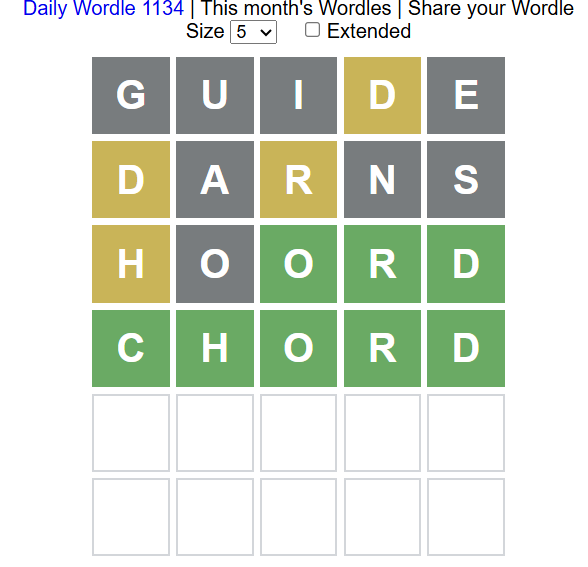

# Wordle-Bot
An entropy-based strategy to wordle  
A wordle game helper


Inspired by [3Blue1Brown](https://www.youtube.com/watch?v=v68zYyaEmEA)

## Install & Run

1. Clone the script: 
```bash
git clone https://github.com/GillesVandewiele/Wordle-Bot.git
```

2. Install tqdm and scipy
```bash
(python -m) pip install tqdm scipy
```

3. Run the script  
**Needs A LOT OF MEMORY (30 GB i think)**
```bash
python wordle.py
```

## Tutorial
The program will show you top 10 choices.
```
*---*
tares 4.293390057374009
lares 4.262798837004158
rales 4.238139680362863
rates 4.225593399668317
teras 4.211991450065488
nares 4.205206640216656
soare 4.201439131142605
tales 4.196997695140222
reais 4.193386309251172
tears 4.181298541459465
*---*
```

You can pick any available word.  
"00200" means gary, gray, green, gray, gray
```
*---*
tares 4.293390057374009
lares 4.262798837004158
rales 4.238139680362863
rates 4.225593399668317
teras 4.211991450065488
nares 4.205206640216656
soare 4.201439131142605
tales 4.196997695140222
reais 4.193386309251172
tears 4.181298541459465
*---*
>>> tares 00200
```
0 -> gray  
1 -> yello  
2 -> green  

Type exit to exit.
```
>>> exit
...\Wordle-Bot-helper>
```

## Example

```cmd
Loaded dictionary with 12972 words...
Calculating entropies...
100%|█████████████████████████████████████████████████████████████████████████████████████████████████████████| 12972/12972 [00:39<00:00, 324.68it/s]
*---*
tares 4.293390057374009
lares 4.262798837004158
rales 4.238139680362863
rates 4.225593399668317
teras 4.211991450065488
nares 4.205206640216656
soare 4.201439131142605
tales 4.196997695140222
reais 4.193386309251172
tears 4.181298541459465
*---*
>>> guide
Bad input
>>> guide 00010
Calculating entropies...
100%|████████████████████████████████████████████████████████████████████████████████████████████████████████████| 272/272 [00:00<00:00, 2035.11it/s]
*---*
darns 3.8522811547057554
dryas 3.7752074369378987
donas 3.747710222337526
dorsa 3.736476739159818
doors 3.7168658751806554
drays 3.7139417969559454
drows 3.689944977119012
drats 3.688956827689966
draws 3.6888457392697096
drony 3.6861005488945997
*---*
>>> darns 10100
Calculating entropies...
100%|██████████████████████████████████████████████████████████████████████████████████████████████████████████████████████████| 8/8 [00:00<?, ?it/s] 
*---*
hoord 1.9061547465398494
loord 1.7328679513998633
boord 1.732867951399863
brood 1.732867951399863
chord 1.6674619334292946
hydro 1.4941751382893083
crowd 1.3862943611198904
fjord 1.2130075659799042
*---*
>>> hoord 10222
Calculating entropies...
100%|██████████████████████████████████████████████████████████████████████████████████████████████████████████████████████████| 1/1 [00:00<?, ?it/s] 
*---*
>>> chord 0.0
*---*
exit
```


## Statistics

I let the bot guess all the words in our word-list and generated a histogram of the required guesses. Can you do better?

